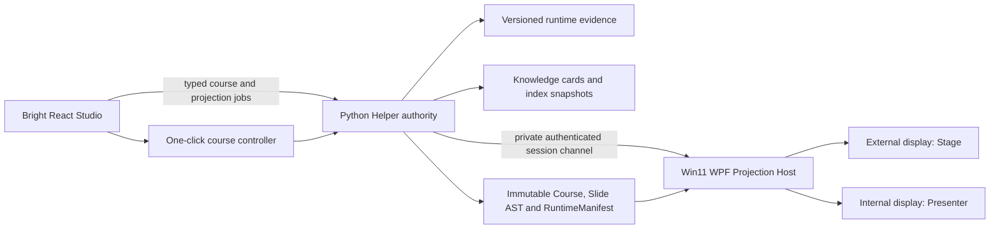
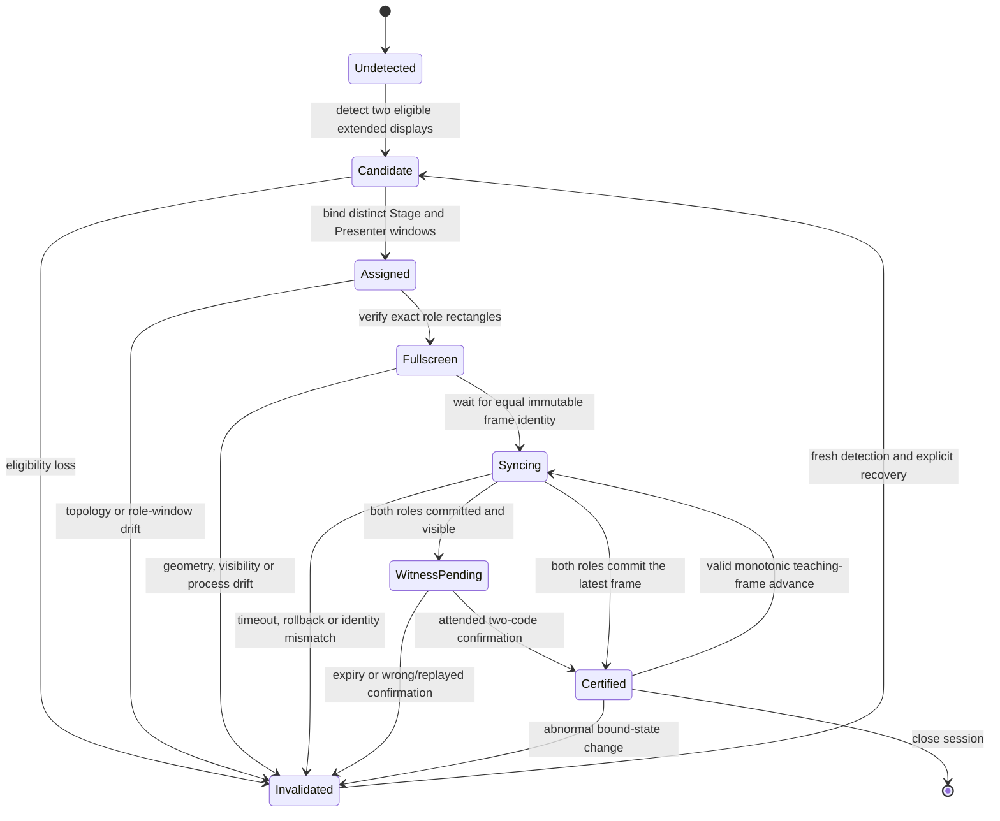

# Win11 physical dual-screen and one-click personal course design

Date: 2026-07-20  
Status: design frozen; awaiting final written-spec review

## 1. Outcome and sequencing

Deliver two milestones in this order:

1. Certify a live personal Win11 dual-screen teaching session through native
   display/window evidence and an attended operator witness.
2. Reduce governed course creation to one primary personal workflow without
   weakening knowledge, visual, publication, or evidence gates.

The dual-screen milestone consumes the already published immutable course
projection. The one-click milestone changes how that projection is prepared,
not the projection or evidence truth model.

## 2. Frozen decisions

- Work in the main workspace only. Do not use `.worktrees`.
- Keep the bright React Studio and the Python Helper as durable product layers.
- Add a lean .NET 10 WPF/WebView2 host rather than relying on browser placement
  alone or implementing the complete signed-release supply chain now.
- Define `physicalDualScreenCertified` as a live, attended certification of
  this personal device session. Keep `releaseSignatureCertified=false` until a
  separately signed release exists.
- Default Stage to the eligible external display and Presenter to the internal
  primary display. Provide one explicit Swap action.
- Never infer physical truth from monitor count, automated events, fake
  adapters, two windows on one screen, RDP, or a historical receipt.
- Preserve browser rehearsal as a clearly non-certifying fallback.
- Use progressive disclosure: friendly names and actions by default; opaque
  identifiers and full evidence only in an advanced evidence drawer.

## 3. System architecture

### 3.1 Studio

The Studio starts and observes projection sessions, displays a bounded status,
and offers Swap, Retry, Re-witness, and Close. It never supplies executable
paths, HWNDs, display IDs from storage, arbitrary URLs, scripts, shell text, or
raw runtime manifests.

### 3.2 Helper

The Helper remains the session and evidence authority. It resolves the existing
published `runtimeManifestId`, validates the immutable course/deck/runtime
digests, starts exactly one contained host build, serializes projection
commands, and persists bounded lifecycle summaries. The browser cannot mint a
certified session directly.

### 3.3 Projection Host

The Host owns two WPF HWND-backed WebView2 windows. It enumerates topology with
Win32, places only its own windows in physical pixels, verifies DPI awareness,
loads the fixed built React projection entries, reports role-bound frame
commits, and owns the attended witness UI.

For this personal-device milestone, the Host may use the installed Microsoft
Evergreen WebView2 Runtime. At session start it records and verifies the runtime
version, canonical process path, Microsoft signature, and executable digest.
Any runtime-process or identity change invalidates the live certification.
This does not set `releaseSignatureCertified=true`.

## 4. Native projection contracts

Expose only six commands through a versioned contract:

1. `detect_displays`
2. `open_projection_session`
3. `assign_projection_window`
4. `enter_projection_fullscreen`
5. `verify_projection_assignment`
6. `close_projection_session`

Each command carries a UUID command ID, expected topology/session generation,
and the minimum typed payload. Replaying one command ID returns the original
receipt only when all bound inputs match. Stale topology or session generations
fail closed.

`DisplayTopology` contains session-anonymous display IDs, topology type,
physical-pixel bounds and work area, DPI/scale, primary/internal/external
hints, and eligibility reasons. Raw PnP paths, EDID, serial numbers, adapter
identities, and device-friendly identifiers never cross into browser data or
receipts.

The Host must be PerMonitorV2 aware before creating the first HWND. It uses
`QueryDisplayConfig`, `EnumDisplayMonitors`, `GetMonitorInfo`,
`GetDpiForWindow`, `GetWindowRect`, DWM extended-frame bounds, visibility,
minimized, cloaked, and target-monitor checks. It must not call APIs that change
resolution, primary-display selection, clone/extend mode, brightness, color, or
other system display settings.

## 5. Live certification state machine

The Host shows different short random codes in native overlays bound to the two
role windows, then opens one native input dialog on Presenter. The user types
both observed codes. Codes expire after 90 seconds, allow one server-side
attempt, are compared in constant time, and are never persisted or logged.

A normal forward slide change enters `syncing`; certification resumes after
both roles commit the same latest frame under unchanged topology, geometry,
navigation, runtime, Helper, Host, course, and manifest identity. It does not
require new codes. Topology/DPI change, move, minimize, cloak, navigation,
process restart, heartbeat loss, frame rollback/divergence, or identity change
invalidates the witness and requires a fresh attended run.

Active certification is memory-only and ends with the session. A persisted
receipt proves only that a past run met the stated checks.

## 6. Dual-screen user experience

The teaching setup shows four compact steps: Detect, Assign, Fullscreen, Verify.
The user normally presses one `Start dual-screen teaching` button; the steps
expand only when attention is required.

- Eligible two-screen device: apply external Stage/internal Presenter defaults,
  show a small topology preview, then ask for one native witness.
- Wrong default: Swap exchanges the two fixed roles and invalidates any prior
  witness.
- Single/duplicate/remote/unknown topology: keep browser rehearsal available
  and display `Physical dual-screen not certified` with one concrete reason.
- Runtime or Host unavailable: keep the published course intact, offer Retry,
  and never imply the session opened.
- Escape exits Host fullscreen safely and immediately invalidates certification.
- Close restores each window's prior style, closes both windows and the Host,
  and seals one bounded final evidence summary.

All controls remain real 44 px buttons with icons, accessible names, keyboard
focus, tooltips, and Escape behavior.

## 7. One-click personal course workflow

### 7.1 Product promise

One personal author should be able to select sources, describe the intended
course in one natural-language field, and press `Generate my course`. The
platform performs governed preparation, retrieval, course structure, visual
selection, validation, and preview preparation. It pauses only for a blocking
truth/safety decision or an uncovered learning goal.

The current detailed workflow remains available as Advanced mode and projects
the same underlying jobs. It must not maintain a second business-logic path.

### 7.2 Quick-start state

Add these durable contracts:

- `CourseQuickStartIntent`: friendly title seed, audience, purpose, duration,
  language, style, selected source IDs, and optional constraints.
- `KnowledgeNamingDecision`: immutable source/card inputs, chosen friendly
  label, alternatives, naming rule, confidence, and evidence digest.
- `ReviewBundle`: tasks grouped only when they share decision kind, subject
  class, evidence policy, and allowed resolution.
- `CourseLayoutPlan`: lesson order, slide intent, selected visual candidates,
  layout template, density score, and rejected-candidate reasons.
- `CourseGenerationRun`: idempotent operation ID, frozen index snapshot,
  current state, attention items, output identities, and evidence IDs.

The run states are `collecting`, `preparing`, `needs_attention`, `composing`,
`preview_ready`, `publishing`, `complete`, `failed_retryable`, `failed_final`,
and `cancelled`. Reopening a run resumes from persisted operation results; it
does not repeat completed imports, reviews, index writes, visual acquisition,
or publication.

### 7.3 Friendly names and hidden identifiers

Default screens never render raw UUIDs, version IDs, snapshot IDs, task IDs, or
evidence IDs. They show source titles, knowledge-unit names, lesson names,
human-readable status, and short diagnostic labels. The evidence drawer may
show shortened identities and provides an explicit Copy full ID action.

Knowledge-unit naming is deterministic and evidence-bound:

1. Prefer a concise source heading or card title.
2. Otherwise synthesize a phrase from the learning goal plus the two strongest
   governed tags.
3. For datasets, use the verified dataset subject and analytical intent, never
   a filename-only label.
4. Reject generic labels such as `Knowledge unit 1`, `Goal 1`, `Supporting
   material`, bare filenames, raw IDs, or duplicated sibling names.
5. Preserve stable internal logical IDs when the friendly label changes.

Names are editable before publish; the edit creates a versioned naming decision
and does not rewrite source evidence.

### 7.4 Compressed review

The default review surface is one attention inbox with three sections:

- `Ready with evidence`: deterministic checks passed; no user action.
- `Confirm together`: tasks with identical policy and resolution can be shown
  as one bundle with one explicit confirmation.
- `Needs individual judgment`: sensitive content, near duplicates, source
  changes, unsupported datasets, rights ambiguity, or conflicting evidence.

Exact duplicate handling and other already deterministic non-blocking outcomes
may resolve automatically using existing evidence rules. A bundle never mixes
subjects, decision kinds, evidence policies, or resolutions. Blocking decisions
cannot be auto-accepted merely to keep one-click flow moving. Every item remains
individually auditable and append-only after a bundled action.

### 7.5 Automatic course and visual composition

Cluster published cards by learning goal and multi-tag similarity, order them
from foundation to application, and allocate the requested duration. Default
lesson size is 5–12 minutes. Merge very small adjacent units and split dense
units; never pad a course with generic chapters. Missing goal coverage pauses
the run with a concise gap card rather than inventing content.

Select visuals in this order:

1. Semantically matching PPTX/source visuals with verified source lineage.
2. Digest-bound charts from governed datasets when a quantitative comparison,
   trend, distribution, or relationship is being taught.
3. Currently authorized licensed network visuals when enabled.
4. A text/structure layout when no authentic visual is available.

Do not generate a decorative fake screenshot, fabricated photo, or unverifiable
diagram. Use at most one hero visual or two supporting visuals per slide. Score
semantic match, authenticity, aspect ratio, text density, attribution space,
and reuse. Distribute related visuals across the narrative instead of stacking
all available assets on the first slide.

Supported deterministic layouts are `hero`, `split`, `comparison`,
`metric-chart`, `process`, and `text-focus`. Every selected asset keeps alt text,
attribution, authenticity evidence, and the exact originating card, source, or
dataset version.

## 8. End-to-end data flow

1. User selects/uploads governed sources and enters one course intent.
2. Helper imports and extracts each source using existing typed pipelines.
3. Helper groups review attention without relaxing individual gates.
4. Accepted cards publish and the Helper waits for the exact resulting index
   snapshot.
5. The quick-start orchestrator parses intent, retrieves cards, detects gaps,
   generates friendly names and an adjustable outline, and records decisions.
6. The layout planner selects authentic visuals and produces placement intents.
7. Existing Slide AST and RuntimeManifest builders validate exact lineage.
8. Studio shows a friendly preview; Advanced evidence remains available.
9. Publish is idempotent and reopens byte-identical immutable projection data.
10. The new Projection Host consumes that published projection for the live
    dual-screen session.

## 9. Error handling and recovery

- Every quick-start stage has a stable operation ID and replay-safe result.
- Cancellation stops pending work but retains already governed sources and
  completed evidence; it never marks a partial course published.
- Helper restart reopens the last durable run state and requires a fresh session
  token. Host restart always loses active dual-screen certification.
- Stale index, course, visual, topology, window, or runtime generations fail
  closed with a friendly next action and an advanced diagnostic code.
- A failed network visual never blocks a course when a truthful text layout is
  possible; it remains blocking when the requirement explicitly demands that
  visual or its claim depends on it.
- No page runs shell commands. Native launch and all execution remain fixed,
  typed, allowlisted, time-limited, and evidence-producing.

## 10. Verification and acceptance

### 10.1 Automated gates

- Contract parity tests for C#, Python, and TypeScript projection payloads.
- Deterministic state-machine tests including stale/replayed commands, topology
  drift, mixed DPI, negative coordinates, role collision, geometry mismatch,
  frame rollback, timeout, and recovery.
- Source gates proving no display-configuration APIs are present.
- Host tests proving fake adapters and test clocks cannot set physical
  certification.
- One-click unit/integration tests for naming, grouping eligibility, gap
  handling, idempotent resume, hidden IDs, lesson sizing, visual scoring, layout
  density, lineage, and failure recovery.
- Existing Helper/Web suites, typecheck, build, QA focused/all, and Chrome E2E
  remain green.

### 10.2 Visible Win11 hardware gate

Run only through an explicit visible `projection-hardware` command. On the
current device it must:

1. Detect the integrated monitor and Samsung external monitor as distinct
   eligible candidates without exposing their raw identities.
2. Open Presenter on the integrated primary display and Stage on the external
   display.
3. Enter exact borderless fullscreen on both displays.
4. Render the same published course and latest frame with role-appropriate UI.
5. Complete the attended two-code witness.
6. Advance a frame and prove temporary `syncing` returns to certified.
7. Move or minimize one window and prove immediate invalidation.
8. Restore, re-witness, close, and prove no orphan window/process remains.

Only that visible run may produce `physicalDualScreenCertified=true`; the same
receipt must retain `releaseSignatureCertified=false`.

### 10.3 One-click product gate

Using one MD, one PPTX and one CSV fixture, prove that a personal user can:

- select sources, enter one course intent, and press one primary Generate action;
- encounter no more than one bundled confirmation unless evidence requires
  individual judgment;
- see no raw UUID-like identifier in the default flow;
- receive meaningful, non-generic knowledge, chapter, lesson, and slide names;
- receive a gap instead of invented content when coverage is insufficient;
- preview a course whose slides contain at most two appropriately distributed,
  decoded, evidence-backed visuals;
- publish, reopen byte-identical content, and start the certified dual-screen
  flow.

## 11. Implementation milestones

Use two separate implementation plans. The first plan contains milestones 1–4
and ends with the physical hardware receipt. Only after that receipt passes does
the second plan contain milestones 5–7. This keeps one primary deliverable on
the critical path and prevents the UI simplification from obscuring native
hardware failures.

1. Projection contracts and deterministic core state machine.
2. Win32 topology, WPF role windows, fullscreen and invalidation.
3. WebView2 projection bridge, Helper supervision and Studio controls.
4. Visible current-device witness and dual-screen acceptance receipt.
5. Quick-start run contracts, friendly naming and compressed review.
6. Automatic course/visual layout and simple Studio experience.
7. Full browser/product acceptance and final reflection.

Each milestone begins with a failing focused test, receives a Supergrill route
and checkpoint, and ends only with a fresh verification receipt.

## 12. Supergrill evolution protocol

The initial `evolution-check` reports four verified units and
`insufficient_evidence`; therefore the stable Supergrill skill must not change
now. After every meaningful milestone, store one strict redacted experience
receipt with model recommendation versus actual execution, elapsed time when
measured, first-pass result, rework, defects, gate result, and attributed
failure.

Re-run `evolution-check` after the hardware milestone and the one-click product
milestone. Create a non-active proposal only if the same failure repeats at
least three times or the store reaches six verified units across three
projects. If eligible:

1. Generate the proposal with `evolution-propose`.
2. Copy the stable skill into a candidate directory; never overwrite it.
3. Run baseline pressure scenarios without the candidate and record the actual
   failure.
4. Apply the smallest evidence-linked change.
5. Re-run the same scenarios plus regression scenarios with the candidate.
6. Compare correctness, rework, tool calls, tokens, and elapsed time.
7. Present the candidate and evidence for explicit activation approval.

If the gate remains immature, report the evidence and leave the stable skill
unchanged. This is a successful safety outcome, not a reason to invent an
improvement.

## 13. Artifact lifecycle

Commit contracts, source, schemas, lock files, bounded receipts, and the final
design/acceptance evidence. Ignore SDKs, NuGet caches, WebView2 user-data
folders, publish output, temporary screenshots, browser traces, crash dumps,
and generated runtime artifacts. After each build or visible audit, inventory
outputs and retain only final named evidence plus non-reproducible source data.
