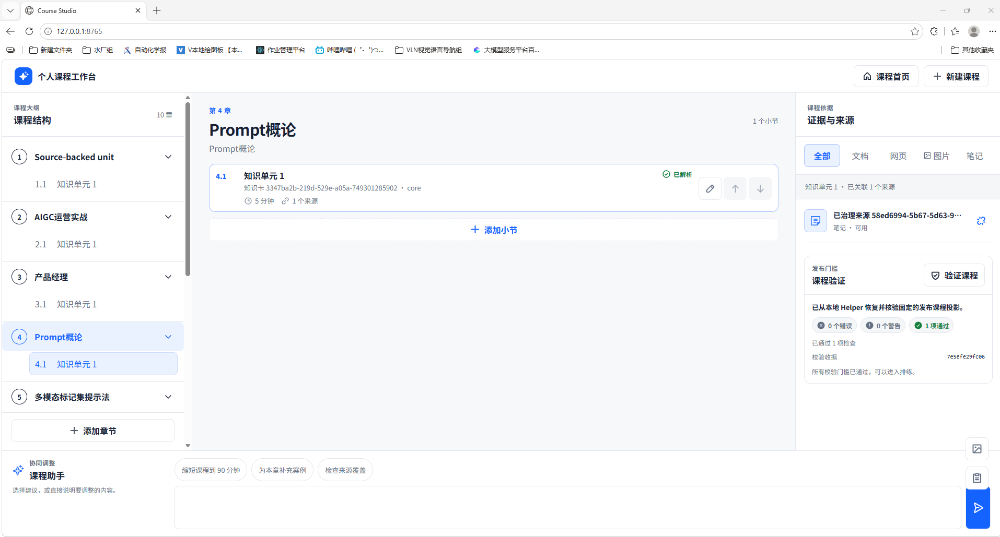
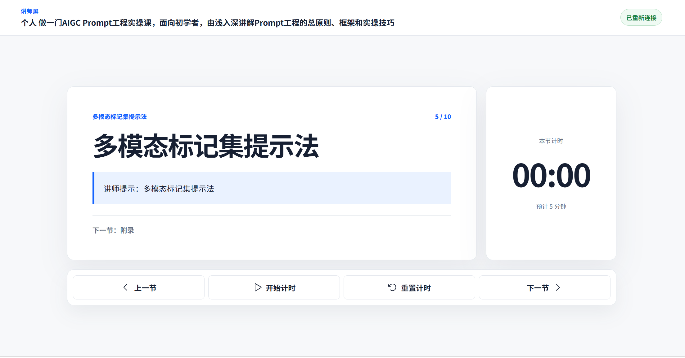
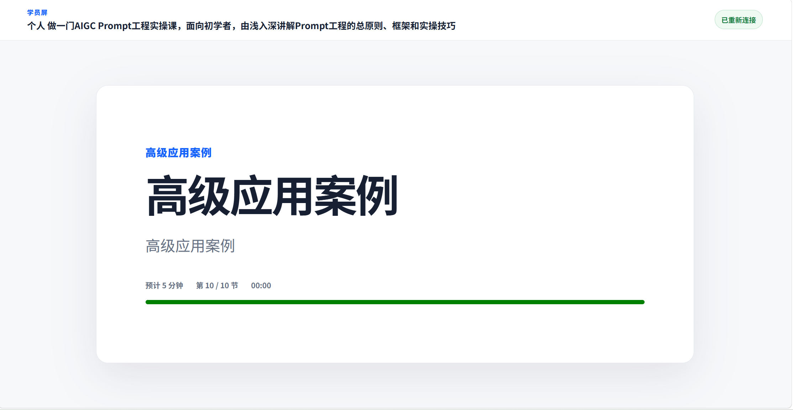

# HtmlPoint 课程工作台 — 问题排查与修复记录

> 整理时间：2026-07-24  
> 项目路径：`d:\文档\GitHub\HtmlPoint`

---

## 目录

1. [启动报错：npm/python 找不到](#1-启动报错npmpython-找不到)
2. [打开空白页（一）：浏览器打开太早](#2-打开空白页一浏览器打开太早)
3. [打开空白页（二）：JS MIME 类型错误](#3-打开空白页二js-mime-类型错误)
4. [打开空白页（三）：浏览器缓存 + fragment 丢失](#4-打开空白页三浏览器缓存--fragment-丢失)
5. [课程创建失败：timestamp 格式不匹配](#5-课程创建失败timestamp-格式不匹配)
6. [中文文件名报错：HTTP header 编码限制](#6-中文文件名报错http-header-编码限制)
7. [创建未完成：extraction evidence 状态判断](#7-创建未完成extraction-evidence-状态判断)
8. [点击开始授课无反应：401 旧令牌](#8-点击开始授课无反应401-旧令牌)
9. [401 报错：同源 GET 请求无 Origin 头](#9-401-报错同源-get-请求无-origin-头)
10. [最终效果](#10-最终效果)

---

## 1. 启动报错，npm/python 找不到

### 现象

运行启动脚本时报错，npm.cmd 和 python 都找不到，无法启动。

### 原因

- **npm.cmd 不在系统 PATH 中** — Node.js 解压在 `E:\nodejs\node-v22.18.0-win-x64\` 但未加入 PATH
- **python 解析到错误版本** — 系统中 python 命令指向 Anaconda 或 Python 3.9，而项目 `pyproject.toml` 要求 `>=3.12,<3.13`
- **pyproject.toml 缺少包发现配置** — setuptools 自动发现时把 `evidence/` 数据目录误识别为 Python 包，导致 `pip install -e .` 失败

### 修复

**`platform/start-course-studio.ps1`（主要修改）**

- 新增 Node.js 工具链自动探测：先检查 PATH 中的 `npm.cmd`，找不到则依次检查 `E:\nodejs\node-v22.18.0-win-x64` 和 `C:\Program Files\nodejs`，找到后将其加入会话 PATH
- 新增前端依赖首次安装：`node_modules` 不存在时自动执行 `npm install`
- 新增 Python 3.12 自动探测：优先用 `py -3.12` 启动器获取 Python 3.12 的完整路径，回退时验证 PATH 中的 python 是否为 3.12
- 新增 Python 依赖首次安装：检测 `fastapi`/`uvicorn`/`duckdb`/`pydantic` 是否可导入，不可导入时自动执行 `pip install -e .`
- 将原来的 `& npm.cmd` 改为 `& $npmCmd`，`& python` 改为 `& $pythonExe`

**`platform/helper/pyproject.toml`**

- 新增 `[tool.setuptools.packages.find]` 段，限定 `include = ["course_helper*"]`，避免 `evidence/` 目录被误识别为 Python 包
- 新增 `[tool.setuptools.package-data]` 段，确保 `.sql` 和 `.json` 文件作为包数据被打包

### 启动方式

```powershell
& "d:\文档\GitHub\HtmlPoint\platform\start-course-studio.ps1"
```

或双击 `platform\启动课程平台.cmd`。首次启动会自动安装依赖并构建前端（约 1-2 分钟），后续启动会跳过直接启动服务器。

---

## 2. 打开空白页（一）：浏览器打开太早

### 现象

启动后浏览器打开是空白页。

### 原因

`server.py` 在 `uvicorn.run()` **之前**就调用了 `open_browser()`。浏览器打开时服务器还没启动，连接失败。用户手动刷新后 URL 丢失了 `#helper=...&nonce=...` fragment，前端显示"请从课程工作台启动"。

```
旧流程: open_browser() → uvicorn.run()   ← 浏览器先打开，服务器还没启动
```

### 修复

**文件：`platform/helper/course_helper/server.py`**

- 将 `uvicorn.run()` 改为后台线程启动，用 `_wait_for_loopback()` 轮询端口直到服务器就绪，**然后再**调用 `open_browser()`
- 新增 `_wait_for_loopback()` 函数：用 socket 轮询 127.0.0.1 端口，最多等待 10 秒确认服务器已就绪
- 控制台打印连接 URL：服务器就绪后在 stderr 打印 `course-helper: open http://127.0.0.1:8765/#helper=...&nonce=...`，即使浏览器没自动打开，也可以从控制台复制这个 URL 手动访问
- 浏览器启动失败不再终止服务器：如果 `webbrowser.open()` 失败，服务器继续运行

```
新流程: 后台启动 uvicorn → 等待端口就绪 → 打印连接 URL → open_browser()
```

---

## 3. 打开空白页（二）：JS MIME 类型错误

### 现象

启动后页面仍然空白。

### 原因

JS 文件的 `Content-Type` 是 `text/plain; charset=utf-8`，而不是 `application/javascript`。浏览器会拒绝执行 MIME 类型为 `text/plain` 的 `<script type="module">`，导致页面完全空白。

这是 Windows 上 Python `mimetypes` 模块的已知问题——它从注册表读取 MIME 类型，而某些 Windows 安装中 `.js` 被映射为 `text/plain`。

### 修复

**文件：`platform/helper/course_helper/static_web.py`**

在挂载静态文件前纠正 MIME 类型：

```python
mimetypes.add_type("application/javascript", ".js")
mimetypes.add_type("application/javascript", ".mjs")
mimetypes.add_type("text/css", ".css")
```

修复前后对比：
- 修复前：`Content-Type: text/plain; charset=utf-8` → 浏览器拒绝执行 → 空白页
- 修复后：`Content-Type: application/javascript` → 浏览器正常执行 → 页面渲染

---

## 4. 打开空白页（三）：浏览器缓存 + fragment 丢失

### 现象

MIME 类型修复后页面仍然空白。

### 原因

两个问题同时存在：

1. **浏览器缓存**：浏览器缓存了旧的 `text/plain` JS 响应，即使服务器已修复 MIME 类型，浏览器仍使用缓存
2. **fragment 丢失**：浏览器打开时 URL fragment（`#helper=...&nonce=...`）可能丢失，导致前端 session 握手失败，显示"请从课程工作台启动"

### 修复

**1. 浏览器缓存旧响应** (`static_web.py`)

- 添加 `Cache-Control: no-store` 头，强制浏览器每次获取最新文件

**2. URL fragment 丢失导致 session 握手失败** (`session.py` + `api.py`)

- 新增 `/v1/session/same-origin` 端点，允许同源 SPA 无需 nonce 直接获取 session token
- 安全性：服务器只监听 `127.0.0.1`，同源请求只能来自 SPA 本身

**3. 前端 fragment 丢失时自动恢复** (`helper-session.ts`)

- 当 fragment 丢失时，自动尝试同源建立 session，不再显示"请从课程工作台启动"

---

## 5. 课程创建失败：timestamp 格式不匹配

### 现象

上传 markdown 文件后输入课程要求，显示"课程创建未能开始，请检查资料后重试。"

### 原因

前端创建课程时需要计算一个 `requestDigest`（SHA-256 哈希），后端用同样的算法验证。但两边的 timestamp 序列化格式不一致：

| 输入 | 前端产生 | 后端 Pydantic 产生 | 匹配？ |
|------|---------|------------------|--------|
| `12:00:00.000Z` | `12:00:00.000000Z` | `12:00:00Z` | **不匹配** |
| `12:00:00.123Z` | `12:00:00.123000Z` | `12:00:00.123000Z` | 匹配 |

`new Date().toISOString()` 绝大多数时候产生 `.000Z`（零毫秒），前端旧代码把它变成 `.000000Z`，但后端 Pydantic 把零微秒的时间戳序列化成 `Z`（去掉小数部分）。格式不同 → SHA-256 哈希不同 → 后端返回 422 → 前端显示通用错误。

### 修复

| 文件 | 改动 |
|------|------|
| `governed-job-factory.ts` | 修复 `helperCanonicalTimestamp`，匹配 Pydantic 的序列化规则：零微秒时去掉小数部分，非零时补齐到 6 位 |
| `knowledge-client.ts` | 改进错误处理，不再吞掉所有错误细节，显示 HTTP 状态码和响应体 |
| `PersonalCourseCreate.tsx` | 错误信息从通用的"请检查资料后重试"改为显示具体错误原因 |

---

## 6. 中文文件名报错：HTTP header 编码限制

### 现象

上传文件名为 `AIGC实操-Prompt工程.md` 的文件后报错：

```
课程创建未能开始：本地知识服务暂不可用（Failed to execute 'fetch' on 'Window': Failed to read the 'headers' property from 'RequestInit': String contains non ISO-8859-1 code point.）
```

### 原因

浏览器 fetch API 规定：**header 值只能包含 ISO-8859-1 字符**（基本就是 ASCII），中文会被直接拒绝。文件名中的中文被直接放进了 `X-Upload-Name` header。

### 修复

| 文件 | 改动 |
|------|------|
| `knowledge-client.ts` | `X-Upload-Name` 值用 `encodeURIComponent(fileName)` 编码 |
| `api.py` | 后端用 `unquote(names[0])` 解码，还原原始中文文件名 |

纯 ASCII 文件名（如 `test.md`）不受影响——`encodeURIComponent` 和 `unquote` 对纯 ASCII 是恒等操作。

---

## 7. 创建未完成：extraction evidence 状态判断

### 现象

上传文件后显示 10 项建议，接受后显示"创建未完成：资料仍保留在本地，可以重新开始并调整课程要求。"

### 原因

1. 上传的 markdown 被成功解析，生成了 **191 个 chunks** 和 extraction evidence
2. 但 extraction evidence 的 `status` 是 `warning`（解析器产生了非致命警告，但解析本身是成功的）
3. `source_is_extractable` 的 fall-through 逻辑（用于 `extraction_status=registered` 的 governed-upload 源）只接受 `status = 'verified'` 的 extraction evidence
4. `warning ≠ verified`，所以源被判定为"不可提取"，导致 `SlideBuildError`

### 修复

| 文件 | 改动 |
|------|------|
| `catalog.py` | `source_is_extractable` 的 fall-through 查询从 `status = 'verified'` 改为 `status IN ('verified', 'warning')`，因为 `warning` 表示解析完成只是有非致命警告 |
| `personal_orchestrator.py` | `_failed_phase` 现在记录 `error_message`（实际错误消息），方便调试 |

---

## 8. 点击开始授课无反应：401 旧令牌

### 现象

点击"开始授课"按钮没有反应，终端持续报 401：

```
GET /v1/personal-courses/.../projection HTTP/1.1" 401 Unauthorized
```

### 原因

服务器重启后旧的会话令牌失效了，前端 `sessionStorage` 里存的还是旧令牌，导致所有请求返回 401。`openCourse` 是 async 函数但没有 catch 错误，所以按钮看起来没反应。

### 修复

| 文件 | 改动 |
|------|------|
| `helper-session.ts` | 新增 `rebootstrapSameOriginSession()` 导出函数，先清除旧令牌再重新获取同源会话令牌 |
| `knowledge-client.ts` | `KnowledgeClient` 构造函数新增可选的 `refreshSession` 回调。`#fetchJson` 收到 401 时自动调用该回调刷新令牌并重试一次请求。`#sessionToken` 从 `readonly` 改为可变 |
| `App.tsx` | 创建 `KnowledgeClient` 时传入 `rebootstrapSameOriginSession` 作为刷新回调；`openCourse` 加了 try/catch，失败时弹窗提示 |

---

## 9. 401 报错：同源 GET 请求无 Origin 头

### 现象

问题 8 的修复生效后（错误从静默变为弹窗提示），但点击"开始授课"仍然报 401：

```
无法打开课程：本地知识服务暂不可用（HTTP 401: {"detail":"unauthorized"}）
```

### 原因

**核心矛盾：浏览器对同源 GET 请求不发送 Origin 头**

后端 `require_session`（`api.py`）的鉴权逻辑要求 `Origin` 头必须精确匹配 `allowed_origin`，但浏览器对**同源 GET 请求不发送 `Origin` 头**（Chrome/Firefox/Edge 均如此）：

| 请求类型 | 方法 | Origin 头 | 结果 |
|---------|------|----------|------|
| `/v1/session/same-origin`（刷新） | POST | `http://127.0.0.1:8765` | 通过 |
| `/v1/jobs`（课程状态查询） | POST | `http://127.0.0.1:8765` | 通过 |
| `/v1/personal-courses/{id}/projection` | **GET** | **空** | **401** |

**为什么自动刷新重试也失败：**

1. `getPersonalCourseProjection`（GET）→ 无 Origin → 401
2. 触发 `rebootstrapSameOriginSession`（POST）→ 有 Origin → 成功获取新 token
3. 用新 token 重试 GET → 仍无 Origin → **再次 401**

无论刷新多少次，GET 请求永远 401。

**代码不一致：**

`session.py` 的 `issue_same_origin_token` 已经接受空 Origin（`origin != ""`），但 `api.py` 的 `require_session` 不接受。两者不一致。

### 修复

**文件：`platform/helper/course_helper/api.py`**

```python
# 修改前
if (
    origin != runtime.launch_session.allowed_origin
    or not runtime.launch_session.verify_token(token)
):

# 修改后
if (
    (origin != runtime.launch_session.allowed_origin and origin != "")
    or not runtime.launch_session.verify_token(token)
):
```

核心差异：条件从 `origin != allowed_origin` 改为 `(origin != allowed_origin and origin != "")`

### 安全性分析

| 关注点 | 分析 |
|--------|------|
| 外部网络访问 | Helper 仅监听 `127.0.0.1`，外部无法访问 |
| 跨源攻击 | 跨源请求携带非空且不匹配的 Origin，仍被拒绝 |
| 空 Origin 场景 | 仅同源 GET 请求，安全 |
| 一致性 | 与 `issue_same_origin_token` 保持一致 |
| Token 验证 | 仍要求有效 `X-Course-Session` token，未削弱 |

---

## 10. 最终效果

修复全部问题后，平台正常运行。以下是最终效果截图：

### 图 1：课程工作台



工作台首页，可以上传资料、输入课程要求、创建课程。

### 图 2：讲师屏



点击"开始授课"后进入的讲师屏，展示课程内容。

### 图 3：学员屏



---

## 附：全部修改文件清单

| # | 文件 | 修改内容 | 对应问题 |
|---|------|---------|---------|
| 1 | `platform/start-course-studio.ps1` | Node.js/Python 自动探测 + 依赖自动安装 | 1 |
| 2 | `platform/helper/pyproject.toml` | 包发现配置 + 包数据配置 | 1 |
| 3 | `platform/helper/course_helper/server.py` | 启动顺序修复 + `_wait_for_loopback` + 连接 URL 打印 | 2 |
| 4 | `platform/helper/course_helper/static_web.py` | MIME 类型纠正 + `Cache-Control: no-store` | 3、4 |
| 5 | `platform/helper/course_helper/session.py` | 新增 `issue_same_origin_token` 方法 | 4 |
| 6 | `platform/helper/course_helper/api.py` | 新增 `/v1/session/same-origin` 端点 + 中文文件名解码 + `require_session` 接受空 Origin | 4、6、9 |
| 7 | `platform/web/src/session/helper-session.ts` | fragment 丢失时同源恢复 + `rebootstrapSameOriginSession` | 4、8 |
| 8 | `platform/web/src/client/knowledge-client.ts` | 错误处理改进 + 401 自动刷新重试 + 中文文件名编码 | 5、6、8 |
| 9 | `platform/web/src/factory/governed-job-factory.ts` | `helperCanonicalTimestamp` 修复 | 5 |
| 10 | `platform/web/src/components/PersonalCourseCreate.tsx` | 错误信息显示具体原因 | 5 |
| 11 | `platform/web/src/App.tsx` | 传入刷新回调 + `openCourse` try/catch | 8 |
| 12 | `platform/helper/course_helper/catalog.py` | `source_is_extractable` 接受 `warning` 状态 | 7 |
| 13 | `platform/helper/course_helper/personal_orchestrator.py` | `_failed_phase` 记录 `error_message` | 7 |
